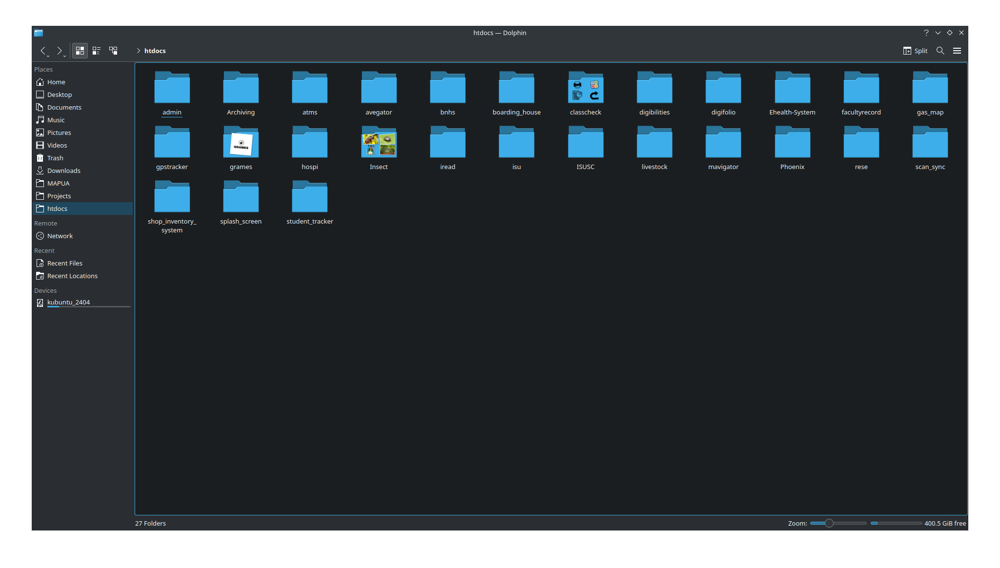

# Welcome to My GitHub Profile!

Hi there! I'm Dave Rhandon Blas, a passionate Software Developer with a strong background in LAMP Stack Development. I specialize in Backend Development and have a keen interest in Networking and Cybersecurity.

## About Me

I love creating innovative and efficient solutions that address real-world challenges. Below are some of my featured projects that showcase my technical proficiency and creativity.

  

## Featured Projects

- **Gate Attendance System (SMS)**
- **Dental Clinic Management System**
- **Digital Portfolio**
- **Digital Reading Comprehension**
- **Barcode Based Attendance System**
- **Shop Inventory System**
- **QR Based Attendance System**
- **School E-Health Monitoring System**

## Skills

- **Languages**: JavaScript, Python, PHP
- **Frameworks**: LAMP Stack, Bootstrap
- **Tools**: AWS EC2, Docker, Git
- **Interests**: Networking, Cybersecurity

## Contact

Feel free to reach out to me via email at daverhandon@gmail.com or connect with me on [LinkedIn](https://www.linkedin.com/in/dave-rhandon-blas-b670b1279) or [Facebook](https://www.facebook.com/people/Rhandon-Dave/100010657007416/).

Thank you for visiting my GitHub profile!
