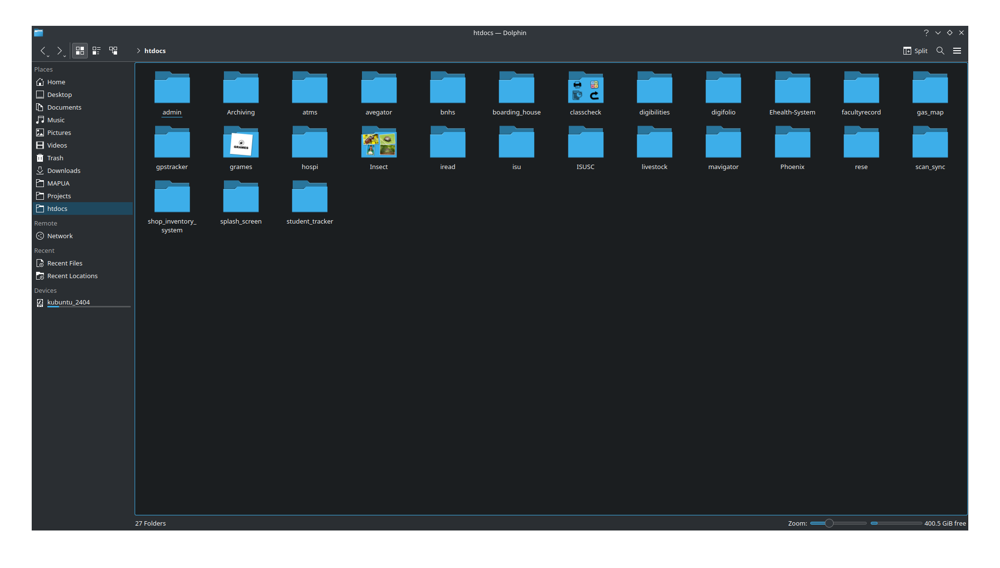

# Welcome to My GitHub Profile!

Hi there! I'm Rhandon, a graduating **Network Engineer** with real-world field experience in network infrastructure, monitoring, and deployment. From climbing poles to diagnose coaxial amplifier issues to fusion-splicing fiber optic cables at a NAP, I understand networks from the physical layer up. Backed by a BSIT degree majoring in Networks and Cybersecurity, I provision equipment, build cross-platform monitoring tools, and approach every problem with both practical know-how and a security-first mindset.

  

## About Me

I'm a network professional who's equally comfortable in a manhole with a fusion splicer and at a terminal configuring a MikroTik router. With a year of field experience as a cable and internet technician, a BSIT degree in Networks and Cybersecurity (graduating August 2025), and daily Linux use since 2024, I bring practical, hands-on knowledge to every layer of the network stack. I build tools, troubleshoot physical infrastructure, and provision equipment—all with a focus on reliable, secure, and maintainable connectivity.

## Featured Network Engineering Projects & Experience

- **Network Monitoring Tool**: A cross-platform network performance and security monitoring tool built with **Python**, designed to run on Linux, Windows, and macOS. Demonstrates scripting skills applicable to real-world network administration. [GitHub Link](https://github.com/Rh4ndon/SecurityScriptProgrammingLab.git)
- **Piso WiFi Network Setup**: Designed, configured, and deployed a small-business internet access network. Responsibilities included full **MikroTik RouterOS configuration** (firewall, bandwidth management, DHCP) and integrating the **Mikhmon** platform for user management and billing—all managed from my Linux workstation. _(Real-world deployment; no public code repository.)_
- **Field Technician — Easter Novo Cable Networks (1 Year)**: Hands-on experience as a cable and internet technician for a local ISP. Key responsibilities included:
  - **Coaxial Network Troubleshooting**: Diagnosed and resolved issues on legacy cable TV infrastructure, including locating faults in taps, amplifiers, and their power supplies.
  - **Fiber Optic Maintenance & Splicing**: Performed troubleshooting at the Network Access Point (NAP), and executed fiber optic cable splicing using a **fusion splicer** to repair and extend connections.

## Education

**Bachelor of Science in Information Technology** — Major in Networks and Cybersecurity  
_Mapúa Malayan Digital College_ | Aug 2022 – Present  
_Expected Graduation: August 2025_

## Other Technical Projects

I completed 32 web and mobile app projects. While primarily software-focused, they showcase the strong technical foundation and problem-solving skills I bring to network engineering.

- **IoT Systems**: Projects like the Smart Trashbin with Wifi—a device that analyzes trash and sorts it into the correct bin, rewarding users with a WiFi token. The WiFi hotspot runs on an **Orange Pi Zero 3** with **Armbian OS** and a Python script managing token distribution. [GitHub Link](https://github.com/Rh4ndon/SegreGreen.git)
- **Full-Stack Applications**: Building web apps has given me a deep understanding of the protocols (HTTP, DNS), servers, and infrastructure that networks support.

  

## Technical Skills

- **Network Design & Architecture**: Formal education in network design principles, routing protocols, and network security architecture.
- **Field Network Infrastructure**: 1 year of professional field experience troubleshooting coaxial cable networks (taps, amplifiers, power supplies) and fiber optic systems (NAP troubleshooting, **fusion splicing**).
- **Network Configuration & Management**: Hands-on experience configuring **MikroTik RouterOS** (firewall rules, queues, DHCP), and using **Mikhmon** for hotspot management.
- **Cybersecurity**: Academic focus on network security principles, protocols, and best practices.
- **Systems & Server Administration**: Linux Daily driver since 2024 comfortable with the command line, shell scripting, system administration, and native network troubleshooting, has experience in Windows Server Manager, Active Directory, and **Windows Server 2019**.
  [[View SAM Test Package]](https://docs.google.com/spreadsheets/d/1aegJ2hnGipW6yB5dtb8fsXqBRzv5ithXMNH4DNKGWXM/edit?usp=sharing)
- **Network Monitoring & Scripting**: Building cross-platform monitoring tools with **Python**. Bash scripting for automation and system tasks.
- **Infrastructure & Protocols**: Practical knowledge of TCP/IP, DNS, DHCP, VLANs, wireless networking (WiFi), and physical layer transmission (coaxial, fiber optic).
- **Supporting Knowledge**: Experience with **Cloud** services (AWS EC2) and **Git** for version control.

## Contact

I'm actively seeking a Network Engineer role where I can contribute field-hardened skills, a security-focused education, and a practical understanding of network infrastructure from the physical layer up. Feel free to reach out to me via email at **daverhandon@gmail.com** or connect with me on [LinkedIn](https://www.linkedin.com/in/dave-rhandon-blas-b670b1279) or [Facebook](https://www.facebook.com/people/Rhandon-Dave/100010657007416/).

Thank you for visiting my profile!
