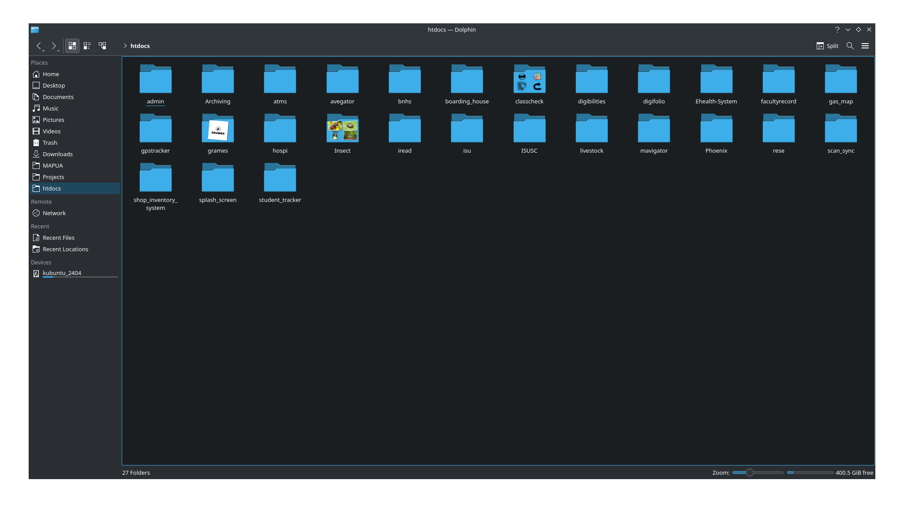

# Welcome to My GitHub Profile!

Hi there! I'm Rhandon — a **Network Engineer & Fullstack Developer** who bridges the gap between physical infrastructure and software systems. Whether I'm fusion-splicing fiber at a NAP or building a backend API with Native PHP, I bring a full-stack mindset to every layer of the stack.

_**BSIT in Networks & Cybersecurity** | Graduated **Magna Cum Laude** — August 20, 2026_

> _"Life has no undo. But you can always commit to a better version."_

  

## About Me

I'm a hybrid professional who's equally comfortable climbing poles with a fusion splicer, configuring a MikroTik router at the terminal, and writing backend logic in PHP. From farm boy to **Magna Cum Laude**—I funded my own education through freelance development and field technician work, applying every MMDC lesson to real-world problems the very next day. With a year of field experience as a cable and internet technician, a BSIT degree in Networks and Cybersecurity, and 32 software projects delivered, I bring rare versatility: I understand networks from the physical layer up, and I build the applications that run on top of them. Daily Linux user since 2024.

---

## 🖥️ Software Development

I specialize in **backend development** with the LAMP stack, building APIs, database architectures, and server-side logic that power web and mobile applications. I also have frontend experience to deliver complete, fullstack solutions.

**30 web & mobile apps + 2 IoT projects completed.**

### Featured Software Projects

- **Smart Trashbin with Wifi** — IoT device that sorts trash and rewards users with WiFi tokens. Backend runs on Orange Pi Zero 3 with Armbian OS and Python. [GitHub Link](https://github.com/Rh4ndon/SegreGreen.git)
- **Smart Trashbin with Charging Station** — IoT system for plastic bottle collection with networked reward mechanism. [GitHub Link](https://github.com/Rh4ndon/Ai_Smart_Trashbin.git)
- **Dental Clinic Management System** — Fullstack web & mobile app for managing clinic operations, appointments, and patient records. [GitHub Link](https://github.com/Rh4ndon/Dental-Clinic-Management-System.git)
- **Student Location Tracker** — Real-time tracking app using cellular and WiFi networks. [GitHub Link](https://github.com/Rh4ndon/asta_nav.git)
- **QR Based Order System** — Networked ordering system with QR code integration. [GitHub Link](https://github.com/Rh4ndon/qr-ordering-system.git)
- **Digital Reading Comprehension** — Bilingual reading platform with cloud-hosted voice narration for children. [GitHub Link](https://github.com/Rh4ndon/digiread.git)
- **Fisherman Management System** — Web app for managing fishing operations and fleet data. [GitHub Link](https://github.com/Rh4ndon/fisherman-management.git)
- **Gate Attendance System (SMS)** — SMS-based attendance management system. [GitHub Link](https://github.com/Rh4ndon/atms_sms.git)
- **Barcode Based Attendance System** — Attendance tracking via barcode scanning. [GitHub Link](https://github.com/Rh4ndon/atms_scanner_base.git)
- **QR Based Attendance System** — QR code attendance management. [GitHub Link](https://github.com/Rh4ndon/qr_base_attendance.git)
- **Shop Inventory System** — Robust stock and inventory management platform. [GitHub Link](https://github.com/Rh4ndon/shop_inventory_system.git)
- **Digital Portfolio** — Learning hub and portfolio platform deployed on cloud infrastructure. [GitHub Link](https://github.com/Rh4ndon/digital_portfolio.git)

  

---

## 🌐 Network Engineering

I've provisioned networks, troubleshooted physical infrastructure, and built monitoring tools—all with a security-first mindset grounded in my academic training.

### Featured Network Engineering Projects & Experience

- **Network Monitoring Tool** — Cross-platform Python tool for network performance and security monitoring. Runs on Linux, Windows, and macOS. [GitHub Link](https://github.com/Rh4ndon/SecurityScriptProgrammingLab.git)
- **Piso WiFi Network Setup** — End-to-end small-business network deployment using **MikroTik RouterOS** (firewall, queues, DHCP) and **Mikhmon** for hotspot user management. _(Real-world deployment.)_
- **Field Technician — Easter Novo Cable Networks (1 Year)** — Local ISP field experience:
  - **Coaxial Troubleshooting**: Diagnosed faults in taps, amplifiers, and power supplies on legacy cable TV infrastructure.
  - **Fiber Optic Splicing**: Troubleshot at the NAP and performed **fusion splicing** to repair and extend fiber connections.

---

## 🎓 Education

**Bachelor of Science in Information Technology** — Major in Networks and Cybersecurity  
_Mapúa Malayan Digital College_ | Aug 2022 – Aug 2026  
**Graduated Magna Cum Laude — August 20, 2026**

**Bachelor of Science in Aeronautical Engineering** _(Undergraduate — 2nd Year)_  
_Holy Angel University_ | Jun 2018 – Aug 2019

---

## 🛠️ Technical Skills

### Network Engineering

- **Field Infrastructure**: Coaxial troubleshooting, fiber optic splicing (fusion splicer), NAP diagnostics
- **Configuration & Management**: MikroTik RouterOS, Mikhmon, TCP/IP, DNS, DHCP, VLANs, WiFi
- **Security**: Network security protocols, firewall configuration, secure network design
- **Monitoring & Scripting**: Python (cross-platform tools), Bash, shell scripting

### Software Development

- **Backend (Specialty)**: PHP, Laravel, Django REST, MySQL, LAMP Stack
- **Frontend**: JavaScript, Bootstrap, React Native
- **Mobile**: Java (Android Studio), React Native
- **IoT & Microcontrollers**: Arduino, ESP32, Orange Pi (Armbian OS), Python

### Systems & Infrastructure

- **OS & Servers**: Linux (daily driver since 2024), Windows Server 2019, Active Directory, GPO, Server Manager
  [[View SAM Test Package]](https://docs.google.com/spreadsheets/d/1aegJ2hnGipW6yB5dtb8fsXqBRzv5ithXMNH4DNKGWXM/edit?usp=sharing)
- **Cloud & Tools**: AWS EC2, Docker, Git

---

## 📬 Contact

I'm open to opportunities in **Network Engineering**, **Backend Development**, or hybrid roles that leverage both skill sets. Feel free to reach out:

- 📧 **Email**: daverhandon@gmail.com
- 💼 **LinkedIn**: [linkedin.com/in/dave-rhandon-blas-b670b1279](https://www.linkedin.com/in/dave-rhandon-blas-b670b1279)
- 🌐 **Portfolio**: [rhandon.tech](https://rhandon.tech)

Thank you for visiting my profile!
